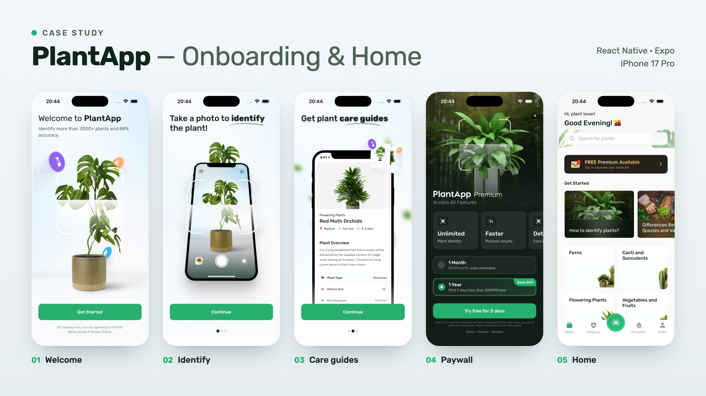

# plant-app

An [Expo](https://expo.dev) app (SDK 57) using [Expo Router](https://docs.expo.dev/router/introduction) with file-based routing.

## Screens




## Get started

1. Install dependencies

   ```bash
   npm install
   ```

2. Start the app

   ```bash
   npx expo start
   ```

Screens and layouts live in `src/app`. Put the rest of the app code elsewhere under `src`.

## Scripts

- `npm run lint` — run ESLint
- `npm run format` — run Prettier
